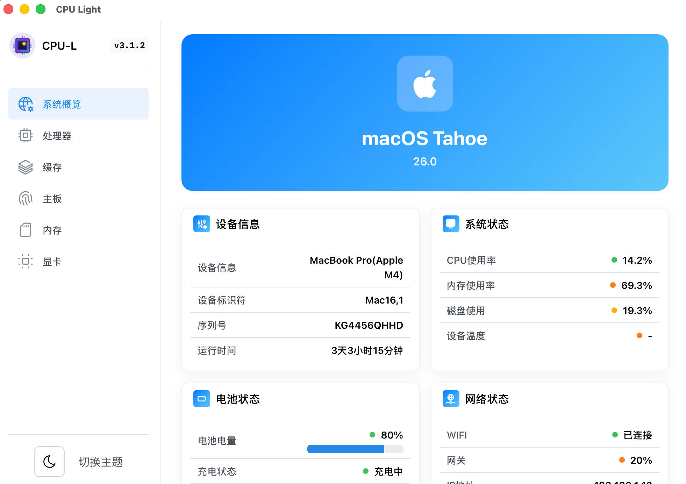

# CPU Light

一个使用 Tauri + React + TypeScript 构建的桌面应用程序。


## 🚀 技术栈

- **前端框架**: React 18 + TypeScript
- **样式方案**: Tailwind CSS
- **桌面框架**: Tauri 2.0
- **构建工具**: Vite
- **代码规范**: ESLint + Prettier
- **包管理器**: pnpm

## 📦 安装依赖

```bash
pnpm install
```

## 🛠️ 开发

```bash
# 启动开发服务器
pnpm dev

# 启动 Tauri 开发模式（推荐）
pnpm tauri:dev
```

## 🔧 构建

```bash
# 构建生产版本
pnpm tauri:build

# 构建调试版本
pnpm tauri:build:debug
```

## 📋 代码规范

```bash
# 检查代码格式
pnpm lint:check
pnpm format:check

# 自动修复代码格式
pnpm lint
pnpm format

# 类型检查
pnpm type-check
```

## 🦀 Rust 相关

```bash
# 检查 Rust 代码
pnpm rust:check

# 运行 Clippy 检查
pnpm rust:clippy

# 格式化 Rust 代码
pnpm rust:format
# 运行 Rust 测试
pnpm rust:test
```

## 🧹 清理

```bash
# 清理构建产物
pnpm clean
```

## ⚡ Vite 配置优化

项目已对Vite进行了针对Tauri的深度优化：

### 🎯 **路径别名**

使用便捷的路径别名提高开发效率：

```typescript
import Component from "@components/Component";
import { utils } from "@utils/index";
import type { MyType } from "@types/global";
```

### 🏗️ **构建优化**

- **代码分割**: 自动分离React和Tauri API到独立chunks
- **资源优化**: 智能处理静态资源和CSS
- **Tree Shaking**: 自动移除未使用的代码
- **压缩优化**: 生产环境自动移除console和debugger

### 🔧 **开发体验**

- **热重载**: 支持React组件和CSS的快速热重载
- **TypeScript**: 完整的类型支持和路径映射
- **环境变量**: 支持不同环境的配置文件
- **源码映射**: 开发环境下的完整调试支持

### 📦 **依赖预构建**

预构建常用的Tauri API模块，提升开发服务器启动速度：

- 窗口管理 API
- 文件系统 API
- 系统通知 API
- 对话框 API
- 剪贴板 API
- 等等...

## 🎯 项目结构

```
├── src/                 # React 前端代码
│   ├── components/      # 组件
│   ├── assets/          # 静态资源
│   └── ...
├── src-tauri/           # Tauri 后端代码
│   ├── src/             # Rust 源码
│   └── ...
├── public/              # 公共资源
└── ...
```

## 📄 开发规范

- 使用 TypeScript 进行类型安全的开发
- 遵循 ESLint 和 Prettier 的代码规范
- 前端代码使用 2 空格缩进
- Rust 代码使用 4 空格缩进
- 提交前会自动运行代码检查和格式化

## 🔍 VS Code 配置

项目已配置 VS Code 工作区设置，包括：

- 自动格式化和错误修复
- 推荐的扩展列表
- TypeScript 和 Rust 语言支持
- 调试配置和任务配置

## 📝 Git 提交

项目配置了 Husky 和 lint-staged，会在提交前自动：

- 运行 ESLint 检查和修复
- 运行 Prettier 格式化
- 确保代码质量

## 🚀 开始开发

1. 克隆项目
2. 安装依赖：`pnpm install`
3. 启动开发服务器：`pnpm tauri:dev`
4. 开始编码！
